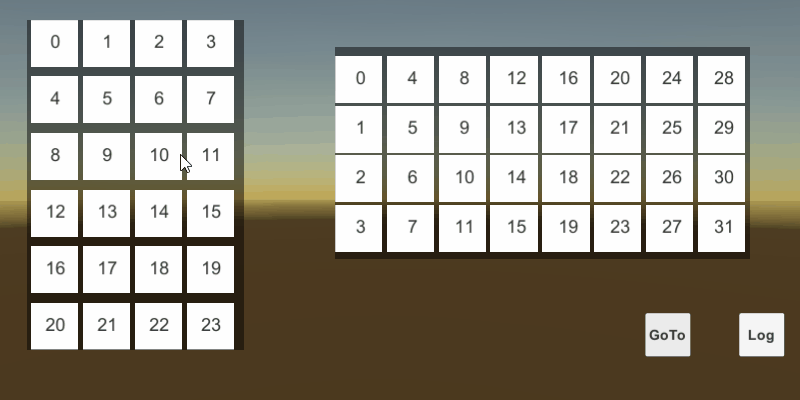

# RecycleViewSample

**11月28日新增**

增加可调节滑动列表的左侧间隙和顶部间隙


采用 **对象池+存储坐标系** 实现的一个可横向或纵向滑动的无限滑动列表

使用命令下面任意命令行克隆这个案例

```
git clone https://github.com/wankcn/RecycleViewSample.git
```

```
git clone git@github.com:wankcn/RecycleViewSample.git
```

**Demo展示：**



**功能支持：**

可以满足大部分如背包，商店商城，工具栏，任务栏窗口等列表功能

- 支持整个列表刷新或单个对象刷新
- 支持横向多行滑动，可设置行数，左右间隔大小
- 支持纵向多行滑动，可设置行数，左右间隔大小
- 支持通过列表索引定位到列表中的某一位置
- 详细可看源码...


**案例测试：**

打开工程后的目录结构如下


打开MainDemo场景，场景上有一个TestScript节点挂在了脚本 **RecycleViewTest.cs**，默认配置了1000个数据和通过索引定位到966位置（暗示上班时常），此处可以修改启动游戏测试。实际开发中，可以参照该脚本中的方法调用对滑动列表进行初始化。


**使用方法：**

在你制作好的scrollview上挂载脚本 **RecycleView.cs**，并且详细参数进行设置，如下图：


目前最大支持10行或10列，如果需要配置更多行，则需要去脚本**RecycleViewEditor.cs**中找到行列设置参数**lines**进行修改

```csharp
rv.lines = EditorGUILayout.IntSlider("Row Or Column", rv.lines, 1, 10);
```


生成你的滑动列表的必要三个步骤：

1. 持有**RecycleView对象rv**，并注册回调函数 **rv.Init(callBackFunc)**
2. **刷新整个列表**（首次调用和数量变化时调用）: ShowList(int count)
3. **在回调函数中做具体的显示，操作等** Func(GameObject cell, int index) 


**示例代码：**

```csharp
public RecycleView VerticalScroll; // 持有对象

void Start()
{
    StartScrollView();
}

public void StartScrollView()
{
    VerticalScroll.Init(NormalCallBack); // 注册回调
    VerticalScroll.ShowList(ListCount);  // 刷新列表
}

private void NormalCallBack(GameObject cell, int index)
{
    // 在该方法中做具体的逻辑
}
```


---

Author: 文若

Unity: 2021.3.9


